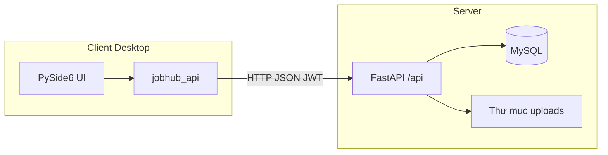

# Bài tập: JobHub — Nền tảng kết nối ứng viên và nhà tuyển dụng

## Format dùng AI tạo base, chỉnh sửa sau

*(Cập nhật thông tin nhóm / lớp / giảng viên phía dưới trước khi nộp.)*

| Mục | Nội dung |
|-----|----------|
| **Môn học** | *(ví dụ: Lập trình Python — …)* |
| **Nhóm / MSSV** | *(điền)* |
| **Đề tài** | JobHub — ứng dụng desktop + API quản lý việc làm, CV và phê duyệt HR |

---

## 1. Mục tiêu

Xây dựng hệ thống có:

- **Máy chủ REST** (FastAPI) xác thực JWT, lưu trữ MySQL, upload file (CV, avatar).
- **Client đồ họa** (PySide6) phân quyền theo vai trò: ứng viên (candidate), nhà tuyển dụng (HR), quản trị (admin).

Người dùng có thể đăng ký / đăng nhập, duyệt tin tuyển dụng, nộp hồ sơ, và (với HR/admin) thực hiện các luồng nghiệp vụ tương ứng giao diện đã thiết kế.

---

## 2. Kiến trúc tổng quan

- **Client:** giao diện `.ui` + stylesheet (QSS), gọi API qua `requests`, lưu session/token cục bộ.
- **Server:** một tiền tố API **`/api`** (ví dụ `/api/auth/login`, `/api/health`); CORS mở cho phát triển.
- **Dữ liệu:** bảng `users`, `hr_profiles`, `jobs`, `cv_documents`, `job_applications`, … (xem `database/schema.sql`).

---

## 3. Chức năng theo vai trò (tóm tắt)

| Vai trò | Chức năng chính |
|---------|------------------|
| **Ứng viên** | Đăng ký/đăng nhập, xem tin, quản lý CV, ứng tuyển, giao diện dashboard người dùng. |
| **HR** | Hồ sơ doanh nghiệp, tạo/chỉnh sửa tin, bảng ứng viên (theo thiết kế màn hình). |
| **Admin** | Duyệt HR / tin đăng, thống kê (biểu đồ), quản lý người dùng (theo module đã triển khai). |

Luồng phê duyệt HR và tin có thể ở trạng thái *pending* cho đến khi admin xử lý (theo schema `approval_status`, `job status`).

---

## 4. Công nghệ sử dụng

| Thành phần | Công nghệ |
|------------|-----------|
| API | Python, FastAPI, Uvicorn, Pydantic, SQLAlchemy |
| Xác thực | JWT (python-jose), mật khẩu băm (passlib/bcrypt) |
| CSDL | MySQL (PyMySQL) |
| Client | PySide6 (Qt), matplotlib (biểu đồ), requests |
| Cấu hình | `.env` (server & client), pydantic-settings |

---

## 5. Cách chạy và kiểm thử

Hướng dẫn chi tiết: **`README.md`** trong cùng thư mục dự án (cài MySQL, import schema, `server/.env`, `run_server.bat`, `client/.env`, `python main.py`).

Kiểm tra nhanh API: `GET /api/health` trả `{"status":"ok"}`.

---

## 6. Kết luận và hướng phát triển

- Hệ thống tách **client — server**, dễ mở rộng thêm endpoint hoặc thay client (web/mobile).
- **Hướng phát triển gợi ý:** thông báo real-time, tìm kiếm nâng cao, kiểm thử tự động (pytest), đóng gói bằng PyInstaller, triển khai HTTPS và reverse proxy trên môi trường production.

---
